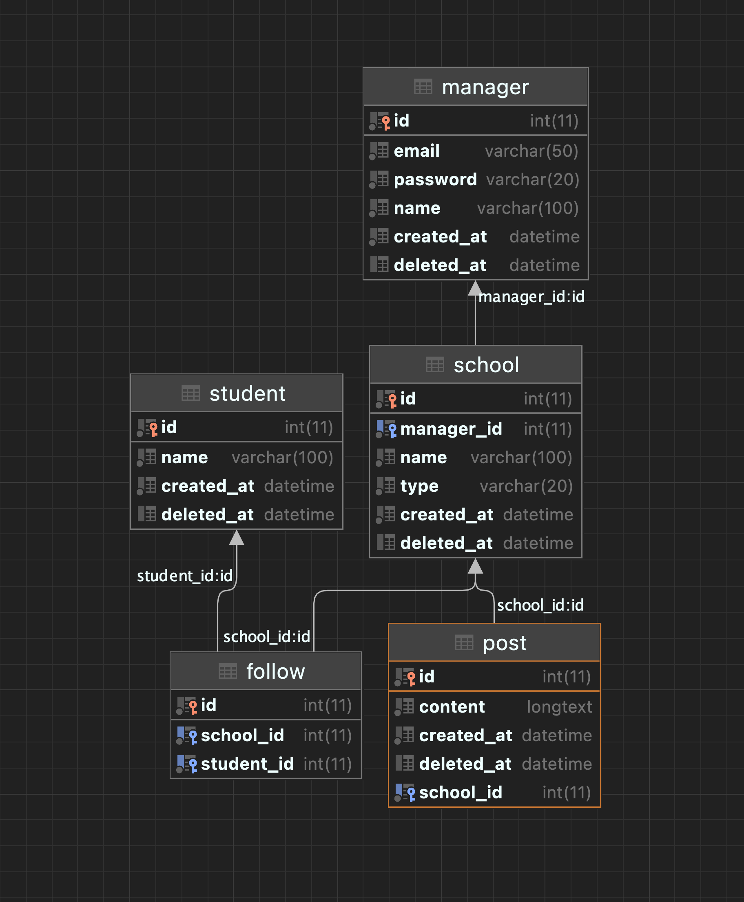

## Description

학교 뉴스피드 기능 

## Installation

```bash
$ npm install
```

## 실행
.env 파일 생성 후
```bash
$ docker-compose up
$ npm run start
```

## endpoints
* api - http://localhost:3000/api
* api-doc - http://localhost:3000/api-doc


## 구현된 기능
* 학교 관리자는 학교 페이지를 운영하여 학교 소식을 발행할 수 있다.
  * 학교 관리자는 지역, 학교명으로 학교 페이지를 생성할 수 있다.
  * 학교 관리자는 작성된 소식을 삭제할 수 있다.
  * 학교 관리자는 작성된 소식을 수정할 수 있다.
* 학생은 학교 페이지를 구독하여 학교 소식을 받아 볼 수 있다.
  * 학생은 구독 중인 학교 페이지 목록을 확인할 수 있다. 
  * 학생은 학교 페이지를 구독할 수 있다.
  * 학생은 구독 중인 학교 페이지를 구독 취소할 수 있다.
  * 학생인 구독 중인 학교 페이지별 소식을 볼 수 있다. (학교별 소식은 최신순으로 노출해야함.)


## 남은 작업
### 요구사항
* 학생은 구독 중인 학교 소식을 자신의 뉴스피드에서 모아볼 수 있다.
* 학교 소식이 노출되는 뉴스피드는 최신순으로 소식을 노출.
* 학교 페이지를 구독하는 시점 이후 소식부터 뉴스피드를 받음.
* 학교 페이지 구독을 취소해도 기존 뉴스피드에 나타난 소식은 유지해야 함. 
* 테스트 코드(school 모듈을 제외한 다른 코드들에 대한 테스트 및 에러에 대한 테스트)

### 더 해야 할 작업
* orm sync 옵션을 켜 둔 상태이므로, 끄고 마이그레이션 코드 작성
* 인증 validation 쪽 대충 작업한 부분 수정
* 공통 응답, 에러처리
* class-validator dto 에 추가


## DB 구조

